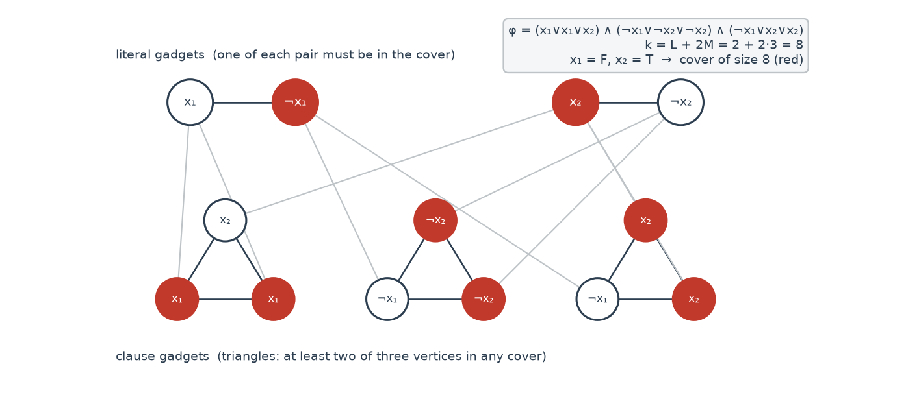
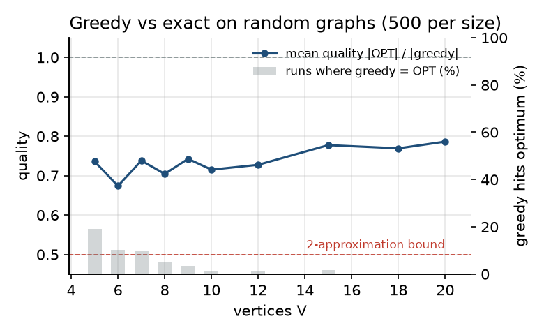
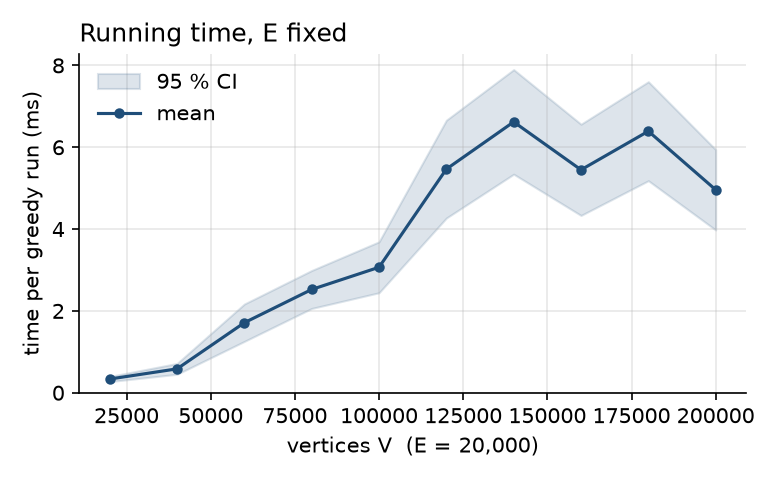
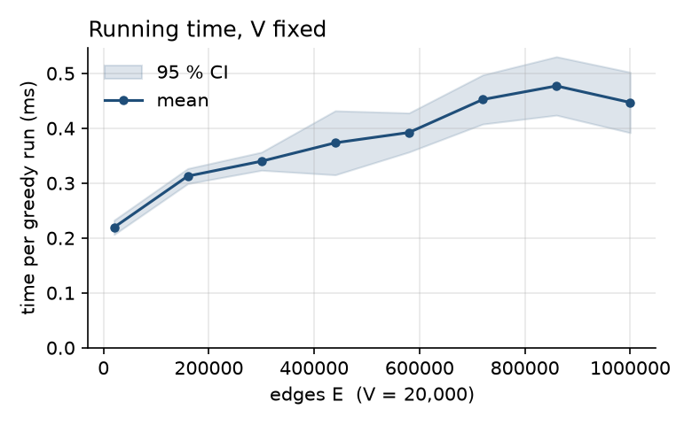

# Problem

Let $G=(V,E)$ be a finite, simple, undirected graph. A **vertex cover** is a set
$C \subseteq V$ such that every edge $\{u,v\} \in E$ has $u \in C$ or $v \in C$.
The **decision problem** asks, given $G$ and an integer $k$, whether a vertex cover
of size at most $k$ exists. The **optimisation problem** asks for a cover of minimum
size, written $\mathrm{OPT}(G)$.

A concrete instance: place the fewest possible traffic cameras at intersections so
that every road segment is watched. Roads are edges, intersections are vertices, and
a camera at an intersection "covers" every road that meets it.

# Vertex Cover is NP-complete

## Membership in NP

A certificate is the set $C$ itself. To check it, mark every vertex of $C$, then
scan the edge list once and fail on the first edge with neither endpoint marked.
This is $O(V+E)$, so Vertex Cover is in NP.

## Reduction from 3-SAT

Let $\varphi$ be a 3-CNF formula with $L$ variables and $M$ clauses. Build a graph
$G_\varphi$ and a bound $k$ as follows.

1. **Literal gadgets.** For every variable $x_i$ add two vertices $x_i$ and
   $\lnot x_i$ joined by an edge. Any cover must contain at least one of them.
2. **Clause gadgets.** For every clause $(\ell_1 \lor \ell_2 \lor \ell_3)$ add a
   triangle with one vertex per literal occurrence. Any cover must contain at least
   two of the three triangle vertices (one vertex leaves an edge of the triangle
   uncovered).
3. **Cross edges.** Join each triangle vertex to the literal-gadget vertex carrying
   the same literal.
4. Set $k = L + 2M$.

{width=88%}

**Claim.** $\varphi$ is satisfiable $\iff$ $G_\varphi$ has a vertex cover of size $\le k$.

$(\Rightarrow)$ Fix a satisfying assignment. Put the $L$ true literal vertices in
the cover; this covers every literal-gadget edge and every cross edge that leaves a
true literal. Each clause has at least one true literal, so at least one triangle
vertex already has its cross edge covered. Put the *other two* triangle vertices in
the cover: this covers the three triangle edges and the remaining two cross edges.
Total: $L + 2M = k$.

$(\Leftarrow)$ Take a cover of size $\le k$. The $L$ literal edges are disjoint, so
at least $L$ cover vertices sit in literal gadgets; the $M$ triangles are disjoint,
so at least $2M$ cover vertices sit in triangles. That accounts for all $k$, hence
*exactly* one vertex per literal pair (defining an assignment) and *exactly* two per
triangle. The third triangle vertex is uncovered, so its cross edge must be covered
from the literal side, which means the corresponding literal is true. Every clause
therefore has a true literal.

The construction has $2L + 3M$ vertices and $L + 3M + 3M$ edges, built in one pass
over $\varphi$. Combined with NP membership, Vertex Cover is NP-complete.

# The greedy algorithm

Because no polynomial exact algorithm is known, we accept a slightly larger cover in
exchange for a guaranteed running time.

## Algorithm

```
C := {}
while there is an edge {u, v} with u not in C and v not in C:
    C := C + {u, v}
return C
```

Equivalently: compute any *maximal matching* and return the endpoints of its edges.
The C++ implementation walks each vertex once and stops scanning its adjacency list
at the first uncovered neighbour:

```cpp
std::vector<int> greedyCover(const Graph& g) {
    const int n = g.vertexCount();
    std::vector<char> inCover(n, 0);
    std::vector<int> cover;
    for (int u = 0; u < n; ++u) {
        if (inCover[u]) continue;
        for (int v : g.neighbors(u)) {
            if (inCover[v]) continue;
            inCover[u] = inCover[v] = 1;
            cover.push_back(u);
            cover.push_back(v);
            break;
        }
    }
    return cover;
}
```

## Correctness

Suppose the output $C$ misses an edge $\{u,v\}$, i.e. $u,v \notin C$. When the
outer loop reached $u$, $u$ was not in $C$, and $v$ was in $u$'s adjacency list and
not in $C$ (vertices are never removed from $C$). The inner loop would therefore
have added both. Contradiction, so $C$ is a vertex cover.

## Running time

The outer loop visits each vertex once. The inner loop over $u$'s neighbours either
stops at the first uncovered one or exhausts the list, so across the whole run each
adjacency-list entry is examined at most once from each side. Total
$O(V + E)$, with $O(V)$ extra memory.

## Approximation ratio

Let $A$ be the set of edges $\{u,v\}$ the algorithm picked. No two edges in $A$
share an endpoint (both endpoints join $C$ the moment an edge is picked, and $C$
only grows), so $A$ is a matching and $|C| = 2|A|$. Any vertex cover, in particular
an optimal one, must contain at least one endpoint of every edge in $A$, and those
endpoints are distinct. Hence $|\mathrm{OPT}| \ge |A|$ and
$$|C| = 2|A| \le 2\,|\mathrm{OPT}|.$$

The bound is tight: on the star $K_{1,n}$ the algorithm picks one edge and returns 2
vertices, while the centre alone is a cover.

{width=100%}

# Exact solver for ground truth

To measure how far greedy is from optimal we need $\mathrm{OPT}$ on small graphs.
`exactCover` enumerates vertex subsets as 64-bit masks in order of increasing
population count (Gosper's hack yields the next mask with the same number of set
bits) and returns the first subset that intersects every edge's two-bit mask. This is
$O\!\left(\sum_{k} \binom{V}{k} \cdot E\right)$ in the worst case and is used only for
$V \le 20$.

# Experiments

All numbers below are reproducible with the commands shown, seed 42, on the
implementation in this repository. Timings were taken natively on Windows 11 with
Clang 20 (via `zig c++`) at `-O3`, on an Intel Tiger Lake laptop CPU. Note that
`std::uniform_int_distribution` is not specified bit-for-bit by the standard, so the
*particular* random graphs, and therefore the exact vertices printed by `solve`,
differ between libstdc++, libc++ and MSVC; the statistics do not.

## Validity

```
vertex_cover verify 10000 1000 10000 20000
valid covers: 10000/10000
```

10\,000 random graphs, $V \sim U[1000, 10000]$, $E \sim U[V, 20000]$, every vertex of
degree $\ge 1$. Every output passed `isVertexCover`, which checks each edge
directly. The same property is enforced as a `ctest` (200 graphs) on every push.

## Approximation quality

Define **quality** $q = |\mathrm{OPT}| / |C| \in [0.5, 1]$, so $q = 1$ means greedy
found an optimum and $q = 0.5$ is the worst case allowed by the bound. For each
$V \in \{5,\dots,20\}$ we draw 500 graphs with $E \sim U[V-1,\ \binom{V}{2}]$.

| $V$ | mean $q$ | worst ratio $|C|/|\mathrm{OPT}|$ | greedy $=$ OPT |
|----:|---------:|---------------------------------:|---------------:|
|  5 | 0.736 | 2.0 | 96 / 500 |
|  6 | 0.674 | 2.0 | 51 / 500 |
|  7 | 0.738 | 2.0 | 49 / 500 |
|  8 | 0.704 | 2.0 | 25 / 500 |
|  9 | 0.743 | 2.0 | 18 / 500 |
| 10 | 0.715 | 2.0 |  6 / 500 |
| 12 | 0.728 | 2.0 |  5 / 500 |
| 15 | 0.777 | 2.0 |  9 / 500 |
| 18 | 0.769 | 2.0 |  1 / 500 |
| 20 | 0.786 | 2.0 |  1 / 500 |

Table: `vertex_cover quality 500`. Quality is the mean over 500 graphs per size.

{width=72%}

Three observations. First, the mean quality sits at 0.70--0.78, i.e. the greedy cover
is typically 25--30\,% larger than optimal, well inside the factor-2 guarantee.
Second, the worst case *is* reached at every size: random sparse graphs regularly
contain star-like pieces where greedy spends two vertices on one. Third, the chance
of hitting the exact optimum collapses as $V$ grows, from 19\,% at $V=5$ to under
1\,% at $V \ge 18$. Greedy is a good bound, not a good exact heuristic.

## Running time

Sizes were chosen so a single greedy run takes milliseconds rather than
microseconds. Each point is the mean of 50 runs on 50 independent random graphs
with an untimed warm-up run per graph; the band is the 95\,% confidence interval
($\bar t \pm 1.96\,s/\sqrt{n}$).

{width=49%}
{width=49%}

With $E$ fixed, time grows linearly with $V$: from 0.25\,ms at 20\,000 vertices to
0.90\,ms at 200\,000, with tight confidence bands. The slope is set by the
sequential pass over `inCover` and the (mostly empty) adjacency lists, i.e. the $V$
term of the bound.

With $V$ fixed, time grows only from 0.22\,ms to 0.45\,ms while $E$ grows fifty-fold,
from 20\,000 to one million. That is not a contradiction of $O(V+E)$: the bound
counts adjacency entries *examined*, and the inner loop stops at the first uncovered
neighbour. In a dense random graph almost every vertex is covered within the first
few hundred outer iterations, after which the remaining vertices are skipped in
$O(1)$ and their adjacency lists are never touched. The worst case
($\Theta(V+E)$) needs adversarial inputs such as long paths with pendant vertices;
random graphs are far from it. The residual growth in $E$ comes from cache misses on
the larger adjacency storage, not from more work per vertex.

# Changes from the 2019 implementation

The original project (Sabancı University CS301, Fall 2019) reached the same
conclusions. The 2026 rewrite keeps its algorithms and experiment design and
tightens three places where the implementation and the specification had room
to drift apart.

**One definition of "cover".** The 2019 code carried two greedy variants, one
timed and one used in the correctness check, and a checker based on vertex
marking. The rewrite has a single `greedyCover` and an `isVertexCover` that
tests the defining property directly, edge by edge. The two are cross-checked
against each other and against the exact solver in the test suite.

**A tighter exact solver.** Subset enumeration by bitmask in order of increasing
size, stopping at the first cover, replaces the combination generator and the
per-subset neighbour lists.

**A validated generator.** `Graph::random` checks the edge budget against
$\binom{V}{2}$ up front, rejects self-loops and duplicates by construction, and
guarantees every vertex a neighbour when the budget allows.

A unit test now asserts, on 300 random graphs, that greedy's output is a cover
according to the edge-by-edge check, is no smaller than the exact optimum, is at
most twice it, and has even size. These four assertions pin the specification
down so that future changes cannot drift from it unnoticed.

# Conclusion

Vertex Cover is NP-complete, by membership in NP and a linear-size reduction from
3-SAT. The maximal-matching greedy algorithm trades optimality for an $O(V+E)$ bound
and a guaranteed factor of 2. Empirically it is about 1.3$\times$ optimal on random
graphs, reaches the factor-2 worst case routinely, and rarely lands exactly on the
optimum. Its running time is linear in $V$ and, on random inputs, nearly independent
of $E$ because the scan stops early. The lasting lesson from the rewrite is about
verification: a checker that tests the defining property directly, cross-checked
against an exact solver, is what makes every other number in this report
trustworthy.

# Reproducing

```bash
cmake -S . -B build -DCMAKE_BUILD_TYPE=Release && cmake --build build
ctest --test-dir build
./build/vertex_cover verify 10000 1000 10000 20000
./build/vertex_cover quality 500 > benchmarks/results/quality-500.csv
./build/vertex_cover bench 50 --out benchmarks/results
python benchmarks/plot.py                 # docs/figures/time-*.png, quality.png
python docs/figures/make_figures.py       # reduction and Petersen illustrations
docker run --rm -v "$PWD:/w" -w /w/docs pandoc/latex:3.6 report.md -o report.pdf
```

The 2019 group report by T. Garib, F. R. Tutaş, D. B. Çakar, M. Arslan and
E. H. Songur (instructor H. Yenigün) is preserved unchanged in `docs/legacy/`.
